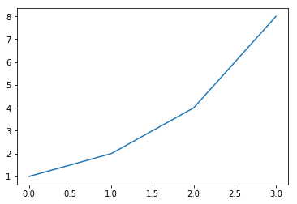

# Table of Contents

1.  [Headings](#org43e225b)
    1.  [subheading](#org46c5206)
        1.  [subsubheading](#orga5bfb61)
2.  [Markups](#org7840c30)
3.  [Lists](#org00f6265)
    1.  [Numbered lists](#org352ce96)
    2.  [plain lists](#org9387976)
    3.  [checklists](#org840f8dc)
    4.  [definition lists](#org2e69783)
4.  [Equations](#org4b1819f)
5.  [Code blocks](#orgd6af078)
6.  [Tables](#org99696cc)
7.  [Citations  label:sec-citations](#orgd4581c4)
8.  [Radio targets](#orgf24283b)
9.  [Cross-references](#org705a19f)
10. [needed](#orgc7a2762)
11. [Exporting](#org32b2a6f)
12. [Handling projects](#orgccd68cc)
13. [Downsides to this approach](#org9f7610f)

Why? Don't we already have org-mode? Yes, but some places like Markdown, it is no fun to write when you have really technical documents, and it would be harder to get markdown-mode to be as good as org-mode than to do this.

# Headings

It goes without saying I hope.

## subheading

### subsubheading

Anything deeper than this gets turned into paragraphs by default.

# Markups

**bold** *italics* underline <del>strike</del> `verbatim` `code`

subscripts: H2O

superscripts: H+

# Lists

## Numbered lists

1.  one
2.  two
3.  three

Note these letters will render as numbers.

1.  apple
2.  bear
3.  cat

## plain lists

-   one
-   two
-   three
    -   with nesting
        -   deeper
    -   back in
-   all the way

## checklists

-   [ ] one
-   [ ] two
-   [ ] three

## definition lists

-   **org-mode:** what makes this possible
-   **emacs:** the other thing you need

# Equations

Suppose you have this equation to solve:

\begin{equation}
8 = x - 4
\end{equation}

    print(f'x = {8 + 4}')

    x = 12

The results above show the answer to [eq-sle](#eq-sle).

# Code blocks

    %matplotlib inline
    import matplotlib.pyplot as plt

    plt.plot([1, 2, 4, 8])

    [<matplotlib.lines.Line2D at 0x10c6d34e0>]

You might like a caption.

./obipy-resources/0a58dae9b8af7857c4824224987cae2f-18961DFU.png

# Tables

You can have tables, with captions and labels.

<table border="2" cellspacing="0" cellpadding="6" rules="groups" frame="hsides">
<caption class="t-above">Table 1: A data table. </caption>

<colgroup>
<col  class="org-right" />

<col  class="org-right" />
</colgroup>
<thead>
<tr>
<th scope="col" class="org-right">x</th>
<th scope="col" class="org-right">y</th>
</tr>
</thead>

<tbody>
<tr>
<td class="org-right">1</td>
<td class="org-right">1</td>
</tr>

<tr>
<td class="org-right">2</td>
<td class="org-right">4</td>
</tr>

<tr>
<td class="org-right">3</td>
<td class="org-right">9</td>
</tr>

<tr>
<td class="org-right">4</td>
<td class="org-right">16</td>
</tr>
</tbody>
</table>

# Citations  

You can have proper scientific citations like this <a href="#kitchin-2015-examp" title="Kitchin, Examples of Effective Data Sharing in Scientific Publishing, &lt;i&gt;{ACS Catalysis}&lt;/i&gt;, &lt;b&gt;5(6)&lt;/b&gt;, 3894-3899 (2015). &lt;a href=" http://dx.doi.org/10.1021/acscatal.5b00538 "&gt;link&lt;/a&gt;. &lt;a href="http://dx.doi.org/10.1021/acscatal.5b00538"&gt;doi&lt;/a&gt;.">kitchin-2015-examp</a>, including multiple references <a href="#kitchin-2015-data-surfac-scien" title=""John Kitchin", Data Sharing in Surface Science, &lt;i&gt;"Surface Science "&lt;/i&gt;, &lt;b&gt;647()&lt;/b&gt;, 103-107 (2016). &lt;a href="http://www.sciencedirect.com/science/article/pii/S0039602815001326"&gt;link&lt;/a&gt;. &lt;a href="http://dx.doi.org/10.1016/j.susc.2015.05.007"&gt;doi&lt;/a&gt;.">kitchin-2015-data-surfac-scien</a>,<a href="#kitchin-2015-examp" title="Kitchin, Examples of Effective Data Sharing in Scientific Publishing, &lt;i&gt;{ACS Catalysis}&lt;/i&gt;, &lt;b&gt;5(6)&lt;/b&gt;, 3894-3899 (2015). &lt;a href=" http://dx.doi.org/10.1021/acscatal.5b00538 "&gt;link&lt;/a&gt;. &lt;a href="http://dx.doi.org/10.1021/acscatal.5b00538"&gt;doi&lt;/a&gt;.">kitchin-2015-examp</a>,<a href="#kitchin-2016-autom-data" title=""Kitchin, Van Gulick \&amp; Zilinski, Automating Data Sharing Through Authoring Tools, &lt;i&gt;"International Journal on Digital Libraries"&lt;/i&gt;, &lt;b&gt;18(2)&lt;/b&gt;, 93--98 (2016). &lt;a href="http://dx.doi.org/10.1007/s00799-016-0173-7"&gt;link&lt;/a&gt;. &lt;a href="http://dx.doi.org/10.1007/s00799-016-0173-7"&gt;doi&lt;/a&gt;.">kitchin-2016-autom-data</a>. Check out the tooltips on them in the html that Github renders.

# Radio targets

In org-mode you can define a target that you can make a link to later.

# Cross-references

Remember in Table [tab-data](#tab-data)?  How about [eq-sle](#eq-sle)? Or that figure we put a caption on (Fig.  [fig-data](#fig-data)).

How about section [sec-citations](#sec-citations) on citations?

Remember the [target](#target) we referred to earlier?

# TODO needed

-   [ ] fix eqref in md export in org-ref
-   [ ] redo how labels are done. Should they be visible?

# Exporting

    (require 'scimax-md)

    scimax-md

To a buffer:

    (pop-to-buffer (org-export-to-buffer 'scimax-md "*scimax-md-export*"))

    #<buffer *scimax-md-export*>

    (require 'scimax-md)
    (org-export-to-file 'scimax-md "scimax-md.md")

    scimax-md.md

# Bibliography
<a id="kitchin-2015-examp">[kitchin-2015-examp]</a> Kitchin, Examples of Effective Data Sharing in Scientific Publishing, <i>{ACS Catalysis}</i>, <b>5(6)</b>, 3894-3899 (2015). <a href=" http://dx.doi.org/10.1021/acscatal.5b00538 ">link</a>. <a href="http://dx.doi.org/10.1021/acscatal.5b00538">doi</a>. [↩](#9e3ad98c9008c49c9d14834ca3913eb6)

<a id="kitchin-2015-data-surfac-scien">[kitchin-2015-data-surfac-scien]</a> "John Kitchin", Data Sharing in Surface Science, <i>"Surface Science "</i>, <b>647()</b>, 103-107 (2016). <a href="http://www.sciencedirect.com/science/article/pii/S0039602815001326">link</a>. <a href="http://dx.doi.org/10.1016/j.susc.2015.05.007">doi</a>. [↩](#66b54b1976758a93506a846c2666419b)

<a id="kitchin-2016-autom-data">[kitchin-2016-autom-data]</a> "Kitchin, Van Gulick \& Zilinski, Automating Data Sharing Through Authoring Tools, <i>"International Journal on Digital Libraries"</i>, <b>18(2)</b>, 93--98 (2016). <a href="http://dx.doi.org/10.1007/s00799-016-0173-7">link</a>. <a href="http://dx.doi.org/10.1007/s00799-016-0173-7">doi</a>. [↩](#fe4ece7c7b3687ca21f32c0ee4e0a542)

# Handling projects

# Downsides to this approach

I never read or edit the markdown that is produced. There is probably a lot of stuff in it you would never write yourself. If that is a problem, there is a lot to do to get rid of it.

This is a one way conversion. If someone edits the markdown, and you re-export, you will clobber their changes.
